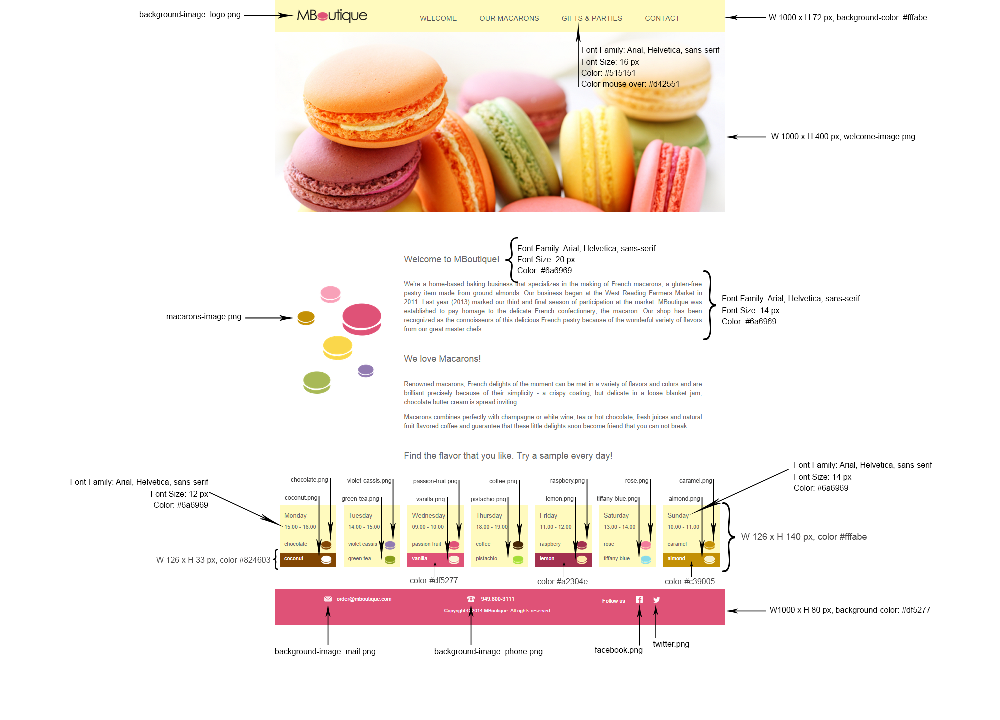
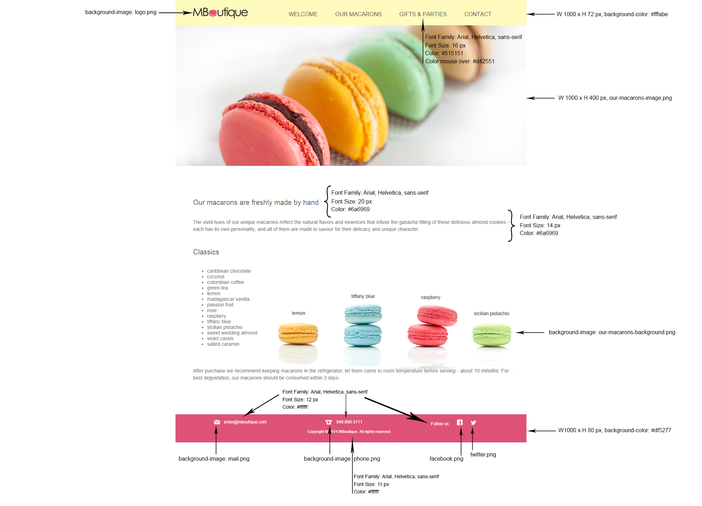
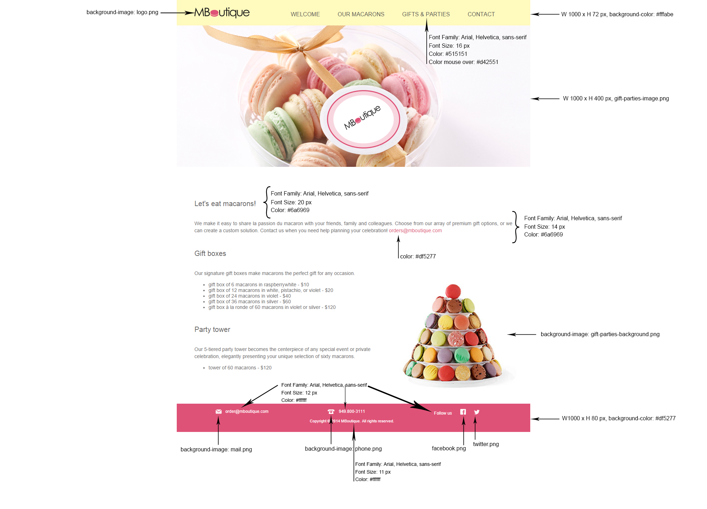
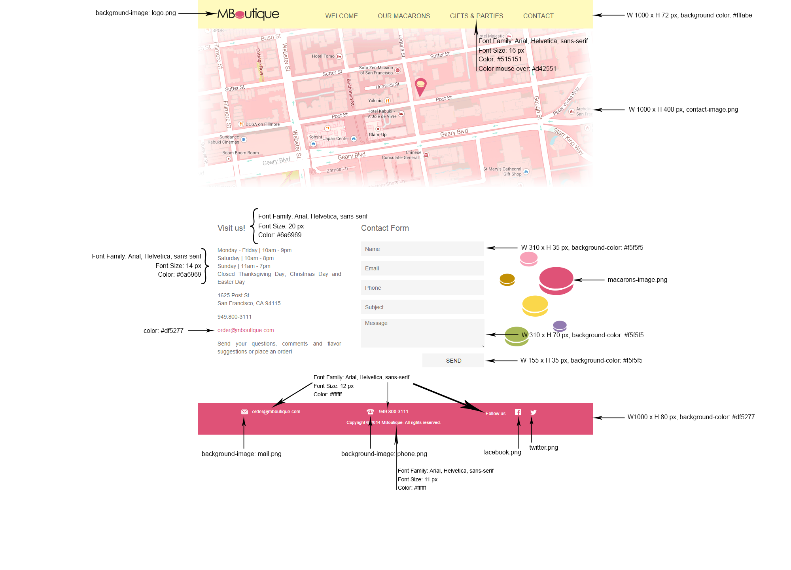

# MBoutique
[Demo] (http://chipchoun.com/M_Boutique/#/welcome)

## About the Project
This project was originally designed to understand html layout and css styling using design docs that were provided from a fictitious company named MBoutique.  After completing the project, I decided to make the site more responsive using Bootstrap. Also, making the site load faster to different content using Angular routing.

##Implemented Features
- Mobile Responsive
- Angular Routing

> The MBoutique webstite contains four separate pages
  - Welcome
  - Our Macarons
  - Gifts & Parties
  - Contact

>###Design Docs

>*Welcome Page*

>*Our Macarons Page*

>*Gifts & Parties Page*

>*Contact Page*

